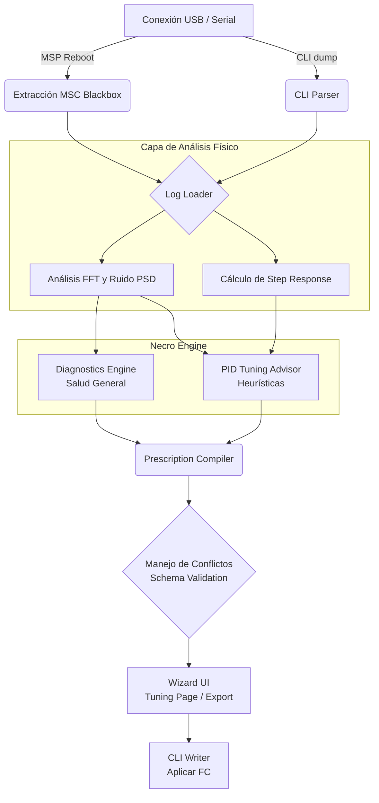

# Open Tuning Tool (Necro Engine)

Una aplicación de escritorio de grado profesional, multiplataforma, diseñada para automatizar, diagnosticar y aplicar sugerencias de tuning (PID y Filtros) para drones FPV utilizando Betaflight. Desarrollado en Python con PyQt6 y pyqtgraph.

## 🚀 Capacidades y Alcance

* **Flujo de Trabajo Automatizado (Wizard):** Interfaz intuitiva y progresiva que guía al usuario desde la extracción del log hasta la aplicación de los comandos en el Flight Controller.
* **Extracción de Blackbox Automática:** Comunicación a bajo nivel con el FC vía protocolo MSP. Activa automáticamente el modo *Mass Storage (MSC)* y extrae los logs binarios resolviendo conflictos de disco.
* **Decodificación al Vuelo:** Wrapper inteligente sobre `blackbox_decode` que procesa los archivos binarios, extrae la tabla de variables y prepara un DataFrame optimizado.
* **Análisis Espectral de Ruido:** Uso de Transformada de Fourier (FFT), Densidad Espectral de Potencia (PSD) y Mapas de Calor (Throttle vs Noise) para aislar ruido estructural y de motores.
* **Necro Engine (Tuning Advisor):** Inteligencia algorítmica y heurística para sugerir parámetros de vuelo:
    * **Step Response:** Análisis de respuesta pasiva (Overshoot y Rise Time) usando modelos teóricos de 2do orden. Incluye reconstrucción matemática de Setpoints si el log no grabó `rcCommand`.
    * **Diagnósticos y Filtros:** Recomendaciones sobre filtros de Gyro y D-Term.
    * **Filtros Avanzados:** Tuning progresivo de RPM Filters y TPA (incluyendo mitigación *EZ-Landing*).
* **Escritura Directa de CLI:** Validador de esquemas nativo basado en el código fuente de Betaflight 4.5. Aplica de forma segura comandos y configuraciones usando serial asíncrono con *feedback* granular.

---

## 🏗 Arquitectura y Módulos

El proyecto mantiene una separación estricta entre la capa de interfaz (`ui/`), el núcleo lógico/serial (`core/`), y el procesamiento de señales (`analysis/`).

### Diagrama de Flujo del Sistema



### 1. Núcleo Lógico y Serial (`fpv_tuner/core/`)
- **`serial/connection.py`**: Wrapper optimizado sobre `pyserial`. Implementa strict timeouts y buffers seguros.
- **`serial/msp.py` & `serial/msc.py`**: Negociación MSP para reiniciar el FC. Descubrimiento y copiado seguro de archivos bajo volúmenes montados FAT32.
- **`serial/cli.py`**: Maneja la interacción interactiva CLI con Betaflight, aplicando cambios y manejando reinicios (`save`).
- **`cli/`**: Generador, esquemas (`betaflight_4_5.json`, etc.) y validador de comandos (comprueba min/max e `is_array` antes de enviar al hardware).

### 2. Procesamiento de Señales (`fpv_tuner/analysis/`)
- **`noise.py`**: Algoritmos pesados. `calculate_throttle_noise_heatmap` e interfaces para FFT.
- **`step_response.py`**: Detección inteligente de *flips* y *rolls* bruscos en el log. Normaliza las muestras y encaja una curva de 2do orden para inferir la respuesta natural del dron.
- **`summary.py`**: Métodos condensados (e.g. `compute_step_response_summary`) para alimentar rápido a la GUI. Incluye la inferencia matemática de *Setpoints* perdidos.

### 3. Tuning Inteligente ("Necro Engine") (`fpv_tuner/core/pid_tuning/`)
- **`advisor.py`**: Fachada principal (Facade) que orquesta todos los sub-analizadores lógicos.
- **`rule_engine.py`**: Base declarativa y dinámica (`tuning_rules.yaml`). Permite actualizar umbrales de seguridad y mitigación sin tocar código Python.
- **Analizadores (`step_response_pid.py`, `rpm_filter_analyzer.py`, `tpa_ezlanding_analyzer.py`)**: Evalúan los DataFrames y emiten objetos de prescripción con justificación, nivel de seguridad (heurístico o validado) y los cambios CLI propuestos.
- **`prescriptions.py`**: Unificador que resuelve conflictos si dos reglas (e.g. Diagnóstico por ruido general vs Advisor) deciden afectar la misma variable.

### 4. Interfaz Gráfica (`fpv_tuner/ui/`)
- **`main.py` & `wizard_shell.py`**: Orquestadores del estado global y la navegación. El UI ya no utiliza pestañas estáticas, sino que es un asistente secuencial de 5 pasos.
- **`app_state.py`**: Almacenamiento singleton para evitar recomputaciones al moverse entre pantallas.
- **`pages/`**: 
  - `WelcomePage`, `LoadPage`: Extracción y parseo.
  - `AnalysisPage`: Ejecución de algoritmos en background (Threads).
  - `DiagnosisPage`: Salud general, voltaje y ruido.
  - `TuningPage`: Recomendaciones inteligentes detalladas con alertas y flags.
  - `ExportPage`: Resumen visual, diff del CLI, y botón de flasheo en tiempo real.

---

## 🛠 Requerimientos e Instalación

1. **Python 3.8+**
2. **Dependencias**: Se listan en `requirements.txt` (incluye `pandas`, `scipy`, `PyQt6`, `pyqtgraph`).
3. **`blackbox_decode`**: El binario oficial de Betaflight. (El proyecto suele requerir que la herramienta exista en tu PATH o dentro del directorio del proyecto).

**Instalación Rápida:**
```bash
git clone https://github.com/Necrophillip/Open-Tuning-Tool.git
cd Open-Tuning-Tool
python -m venv venv
source venv/bin/activate
pip install -r requirements.txt
```

**Ejecución:**
```bash
venv/bin/python fpv_tuner/main.py
```
